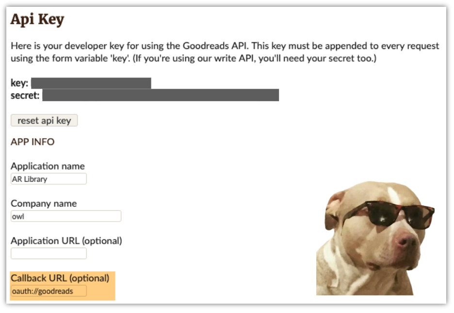
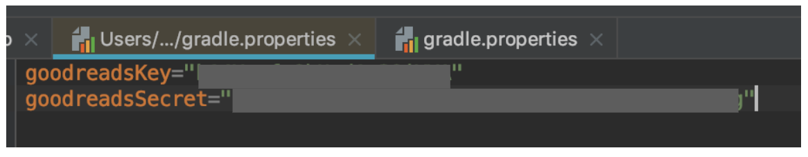

#  GR_API


[](https://opensource.org/licenses/MIT)


Goodreads _unofficial_ android SDK.

## Features
SDK handles login via OAuth with access token storage management and allow you to make requests to [goodreads api](https://www.goodreads.com/api/index) with no pain. All code written in modern Kotlin. 🚀

Currently supported api methods: 

[]() []() []() []() 
[]() []() []() 

[]()
[]()

I’m currently adding the rest of the methods, so if you have feature requests or pull requests or just a comments - open an issue and I will try to help you. RFC.

You can find implementation details at my [Medium Post](https://medium.com/@intmainreturn00/goodreads-api-from-android-with-kotlin-fd8c2c7338d8) 

If you’d like the work, star this repo ⭐️ or you can [buy me a cup of coffee](http://ko-fi.com/intmainreturn00) ☕️

## Setup
1. Make sure you have the jitpack repo in your project level `build.gradle` :


```gradle
allprojects {
    repositories {

        maven { url 'https://jitpack.io' }
    }
}
```

2. Add the dependency to your app `build.gradle` :
```gradle
implementation 'com.github.intmainreturn00:grapi:1.3'
```

3. Register your app at [Goodreads](https://www.goodreads.com/api/keys)
<p align="center">

</p>

I recommend storing api key and secret at global `gradle.properties` file - this way you don’t risk accidentally post it to git and its a common practice. This file usually can be found at your user home directory. [[about global properties](https://medium.com/code-better/hiding-api-keys-from-your-android-repository-b23f5598b906)]. This is the way I do it at sample app. (don’t mess it with local `gradle.properties`, which can be added to git)

<p align="center">

</p>

4. OAuth authorisation requires redirect, so you need to add this intent filter with your callback url, given from goodreads registration. (_change host and scheme to your names - at sample app I used manifestPlaceholders for it_)

```xml
<intent-filter>
    <action android:name="android.intent.action.VIEW"/>
    <category android:name="android.intent.category.DEFAULT"/>
    <category android:name="android.intent.category.BROWSABLE"/>
    <data
            android:host="${host}"
            android:scheme="${scheme}"/>
</intent-filter>
```

## Usage
Initialise before usage. (_I don’t keep reference to context, just using it for shared prefs, so don’t be afraid of memory leaks_)

```kotlin
grapi.init(this, BuildConfig.goodreadsKey, BuildConfig.goodreadsSecret, BuildConfig.goodreadsCallback)
```

### OAuth:

```kotlin
login.setOnClickListener {
    if (!grapi.isLoggedIn()) {
    	launch {
       	   grapi.loginStart()
           browse(grapi.getAuthorizationUrl())
        }
    } else {
       tryUseApi()
    }
}
```
the code below should be called from activity with previously added intent filter to catch redirect intent from browser

```kotlin
launch {
  grapi.loginEnd(intent) { ok ->
    if (ok) {
      // here we can start using api!
      tryUseApi()
    }
  }
}
```

and thats it for login. You can start making a requests to API. The sdk will keep access token at private shared prefs so you can just start using the api second time the user gets into your app. 

### Requests

```kotlin
launch {
    val userId = grapi.getUserId()
    val shelves = grapi.getUserShelves(1, userId.id)
    val reviews = grapi.getReviewList(
        userId.id,
        "read",
        1, 2,
        sort = Sort.NUM_PAGES,
        order = Order.DESCENDING
    )
    val book = grapi.getBookByISBN("837054150X")
    val book2 = grapi.getBookByGRID("13588846")
    val res = grapi.getSearchResults("Wiedźmin")
    val user = grapi.getUser(userId.id)
    val allReviews = grapi.getAllReviews(userId.id, shelf = "favorites")
    val allShelves = grapi.getAllShelves(userId.id)
}
```

As you can see at sample app, I’m launching coroutines from ScoupedActivity context. Beware not to use requests methods from main thread.
